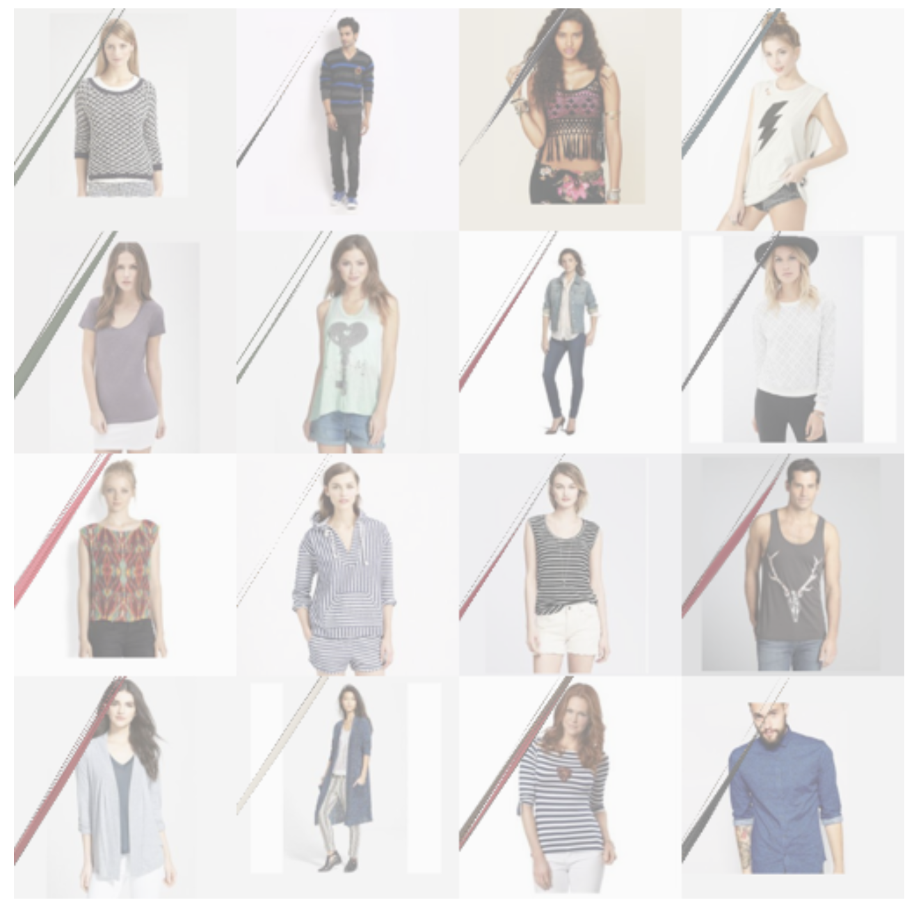

## Appendix

### Other Experiments:

L2 Objective for GAN:


### Loss Plot




G produces parameters so that a major part of the bag is out of frame. It learned a trivial solution, when using the L2 loss.


## Markdown

```markdown
Syntax highlighted code block

# Header 1
## Header 2
### Header 3

- Bulleted
- List

1. Numbered
2. List

**Bold** and _Italic_ and `Code` text

[Link](url) and 
```


