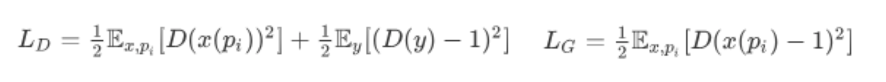
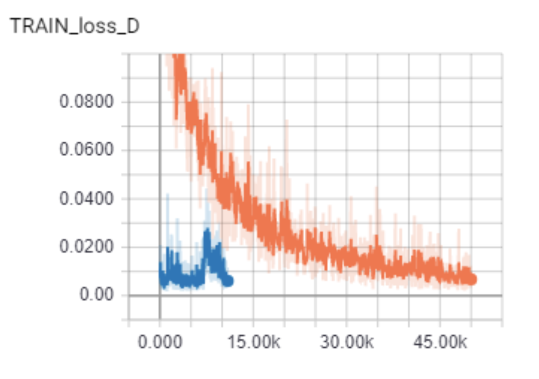
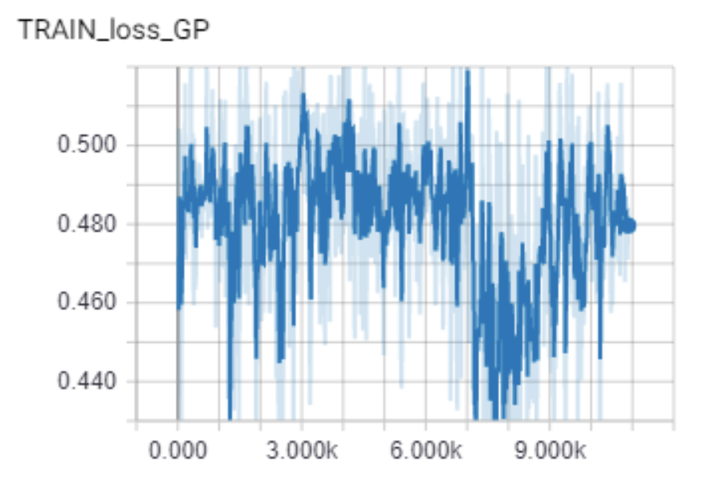

## Appendix

### Other Experiments:

L2 Objective for GAN:

### Loss Plot

G produces parameters so that a major part of the bag is out of frame. It learned a trivial solution, when using the L2 loss.

### DC-GAN experiment

We tried setting up the DC-GAN with the DeepFashion - Fashion synthesis dataset. The default architecture supports generation of images of size 64x64. After training the model, the generated images of size 64x64 were pretty good. But we required images to be of higher resolution than that. So, we tried making required changes to the default architecture to support generation of higher resolution images but the model seemed to be too slow at learning. After training it for around 1500-2000 iterations, the Generator loss got stuck at 100 and the discriminator loss around 0. And then observing the output, the generated images were very poor, not even vaguely close to human body form. On continuing the training, the model seemed to be stuck at one point and hence we decided to move to StyleGan2 which proved to be working well for high-resolution image generation.