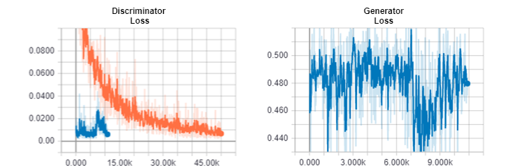
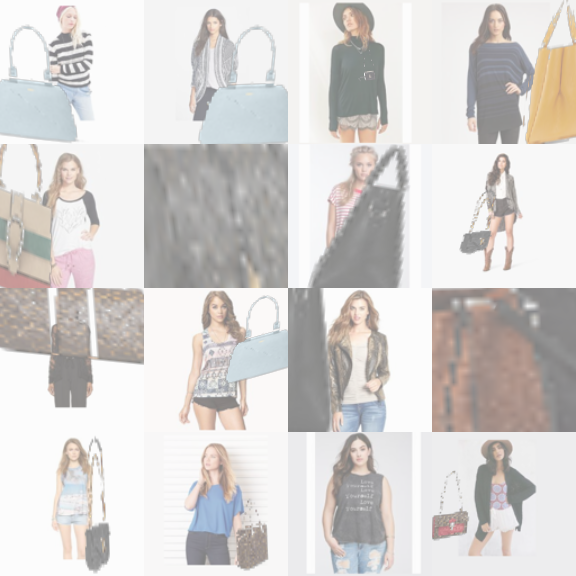

## Addendum
## Architecture Details of the final model:
```
Generator(
	(0):Conv2d(7, 32,kernel_size=(4, 4), stride=(2, 2), padding="SAME", bias=True),
	(1):ReLU(),
	(2):Conv2d(32, 64,kernel_size=(4, 4), stride=(2, 2), padding="SAME", bias=True),
	(3):ReLU(),
	(4):Conv2d(64, 128,kernel_size=(4, 4), stride=(2, 2), padding="SAME", bias=True),
	(5):ReLU(),
	(6):Conv2d(128, 256,kernel_size=(4, 4), stride=(2, 2), padding="SAME", bias=True),
	(7):ReLU(),
	(8):Conv2d(256, 512,kernel_size=(4, 4), stride=(2, 2), padding="SAME", dilations=1, bias=True),
	(9):ReLU(),
	(10):Linear(512, 256),
	(11):ReLU(),
	(12):Linear(256, 6) 
)
```
```
Discriminator(
	(0):Conv2d(7, 32, kernel_size=(4, 4), stride=(2, 2), padding="SAME", bias=True),
	(1):LayerNorm(32, epsilon=1e-05)
	(2):LeakyReLU(0.2)
	(3):Conv2d(32, 64, kernel_size=(4, 4), stride=(2, 2), padding="SAME", bias=True),
	(4):LayerNorm(64, epsilon=1e-05)
	(5):LeakyReLU(0.2)
	(6):Conv2d(64, 128, kernel_size=(4, 4), stride=(2, 2), padding="SAME", bias=True),
	(7):LayerNorm(128, epsilon=1e-05)
	(8):LeakyReLU(0.2)
	(9):Conv2d(128, 256, kernel_size=(4, 4), stride=(2, 2), padding="SAME", bias=True),
	(10):LayerNorm(256, epsilon=1e-05)
	(11):LeakyReLU(0.2)
	(12):Conv2d(256, 512, kernel_size=(4, 4), stride=(2, 2), padding="SAME", bias=True),
	(13):LayerNorm(512, epsilon=1e-05)
	(14):LeakyReLU(0.2),
	(15):Conv2d(512, 1, kernel_size=(3, 3), stride=(1, 1), padding="SAME", dilations=1, bias=True)
)
```
**Some important hyper-parameters:** 
```
Image-transforamation: Affine, 
Batch-Size: 20, 
Initial Foregound Image perturbation:0.2,
Number of warps: 5,
Number of iterations in each warp: 50,000
```

## Other Experiments:

### DC-GAN experiment: For generating new humans

We tried setting up the DC-GAN with the DeepFashion - Fashion synthesis dataset. The default architecture supports generation of images of size 64x64. After training the model, the generated images of size 64x64 were pretty good. But we required images to be of higher resolution than that. So, we tried making required changes to the default architecture to support generation of higher resolution images but the model seemed to be too slow at learning. After training it for around 1500-2000 iterations, the Generator loss got stuck at 100 and the discriminator loss around 0. And then observing the output, the generated images were very poor, not even vaguely close to human body form. On continuing the training, the model seemed to be stuck at one point and hence we decided to move to StyleGan2 which proved to be working well for high-resolution image generation.


### ST-GAN: L2 Objective
We tried changing the GAN Objective to L2 Objective to check the quality of the image being generated. Keeping everything else as constant, we changed the GAN Objective from 
WGAN to L2. Below are the loss functions for the Discriminator and the Generators.

<div style="text-align:center"> </div>

<div style="text-align:center"> </div>

Where, *p<sub>i</sub>* are the parameters that the generator produces and *x(p<sub>i</sub>)* is the composite image of the foreground and the background after the foreground (bag) image has been transformed using *p<sub>i</sub>*

#### Loss Plot



The orange curve is the Phase 1 training's loss of the Discriminator and the blue curve is the Phase 2 training's loss of both the Discriminator and the Generator. We stopped the Phase 2 training after 12k iterations as the Discriminator's loss was really low but the results were bad as shown below.

#### Results


The Generator produces parameters such that a major part of the bag is out of frame. It learned a trivial solution of removing the bag entirely from the background image, when using the L2 loss.
### ST-GAN: Image Transformation - Homography
We tried using Homography as our image transformation (the one used in the original paper) with our new network as stated above and keeping everything else as constant. Below are the results. 

<div style="text-align:center"></div>

As you can see, a lot of the bags blew up. We think this might be because a lot of the crawled images have non-white background and the 2 extra degrees of freedom this transformation has over affine. So, in an effort to restrict the transformations applied on the bags, we tried changing the transformation parameters to affine and that seems to work well.

### ST-GAN: Experiments with Hyper-parameter Tuning

We also tried changing other hyper-parameters such as number of warps, number of iterations, batch size, scale of initial perturbation etc. When increasing the number of iterations to a 100k in each warp we found results to be overfitting, and when decreasing it to a 25k it started underfitting. We observed similar results when increasing or decreasing the number of warps from 5. Batch size changes and initial perturbation changes did not make significant differences in the results.
